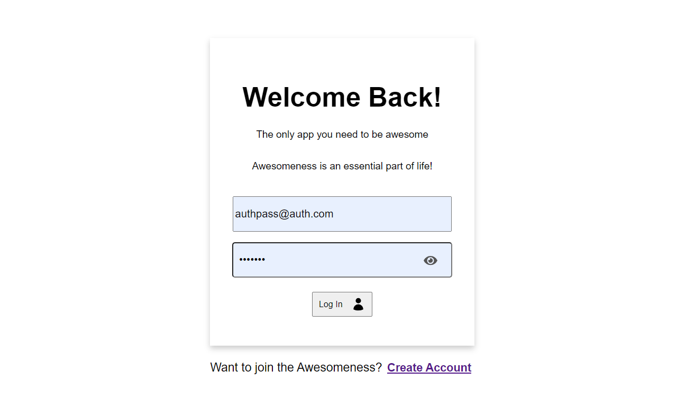
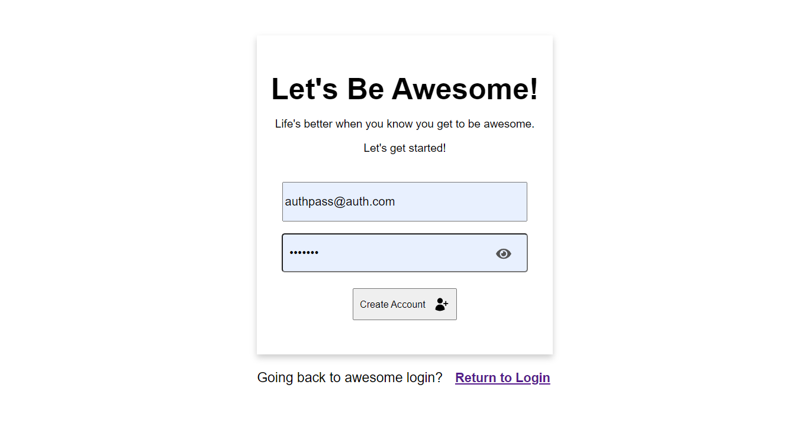

# AuthPass

AuthPass is a boiler plate package for easily integrating **Firebase authentication** into your React applications. It provides a simple setup for user authentication with a login and registration page.

## Features

- **Firebase Authentication**: Seamlessly integrate Firebase Auth for user authentication.
- **Pre-configured Pages**: Includes pre-built pages for Login and Registration.
- **Automatic File Setup**: Installing the npm package automatically downloads all necessary files into your project.

Login Page


Register Page


### Firebase Setup

To use the authentication functionality provided by **AuthPass**, you'll need to set up a Firebase account and project. This is required because Firebase Authentication handles the login and registration processes. Follow these steps to configure Firebase for your app:

#### 1. Create a Firebase Project
- Go to the [Firebase Console](https://console.firebase.google.com/).
- Click on **Add Project**.
- Enter your project name and click **Continue**.
- Disable **Google Analytics** (if you don't need it), then click **Create Project**.
- Once your project is created, click **Continue** to open the project dashboard.

#### 2. Add Firebase to Your Web App
- In your Firebase project, click on the `</>` (Web) icon to create a new Web app.
- Register the app with a name of your choice, then click **Register App**.
- Firebase will provide a configuration object with API keys. Copy this information for the next step.

#### 3. Update `firebase-config.js`
- After installing **AuthPass**, navigate to `firebase/firebase-config.js` in your project.
- Replace the default configuration with your Firebase project's credentials.

```jsx
// firebase/firebase-config.js
import { initializeApp } from "firebase/app";
import { getAuth } from "firebase/auth";

const firebaseConfig = {
  apiKey: "YOUR_API_KEY",
  authDomain: "YOUR_PROJECT_ID.firebaseapp.com",
  projectId: "YOUR_PROJECT_ID",
  storageBucket: "YOUR_PROJECT_ID.appspot.com",
  messagingSenderId: "YOUR_MESSAGING_SENDER_ID",
  appId: "YOUR_APP_ID",
};

// Initialize Firebase
const app = initializeApp(firebaseConfig);
export const auth = getAuth(app);
```

#### 4. Enable Firebase Authentication
- In the Firebase console, go to **Authentication** in the left sidebar.
- Click on **Get Started** and enable the sign-in methods you want (e.g., Email/Password, Google).
- Your Firebase Authentication is now ready!

#### 5. Testing the Setup
After setting up Firebase and updating the config file, you're ready to use the login and register pages in **AuthPass**. Simply run your project, and you should be able to authenticate users through Firebase.

---

By following these steps, you'll be able to leverage Firebase's authentication system within `AuthPass`.

### License 
This project is licensed under the MIT License.

### Contributing
Feel free to submit issues or pull request for improvements and new features!

### Customization

- **Add More Details**: You can expand on sections like Usage or Features depending on what you want to convey to users.
- **Include Screenshots**: If you have any screenshots of the login/register pages, you can include them to help users visualize the package.
- **Contributing Guidelines**: If you want to encourage contributions, you might add specific guidelines for contributors.

Feel free to modify any parts to better suit your style or the specifics of your package! If you need more adjustments or additional sections, just let me know!


